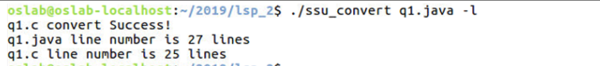

# Convert_Java_to_C

[COPYRIGHT]

2019 SoongSil University Computer Science OS Lab (as the examiner) and ChoiYoungRim (as a student).

[CAUTION]

I'm not a native english speaker, so please consider it when you read this script.
This program was written in Ubuntu Linux 16.04(64bits).

[OVERVIEW]

This project is a real-time converting program from C file to Java file, but it can only convert C files to Java files 
in limited circumstances.

If you want to run or check my project files, clone my files and do 'make' command to build an executable file 'ssu_score'.
After you did above recommendations, do './ssu_score [FILE_NAME] [OPTIONS]'. There are three files to convert which are 
'q1.java','q2.java' and 'q3.java'. After converting, there must be 4 C files which are 'q1.c', 'q2.c', 'q3.c' and 'Stack.c'.

Before running these files, you have to set up some java options.

![java1.png]/(./image/java1.png)

![java2.png]/(./image/java2.png)

![java3.png]/(./image/java3.png)

There are several options that you can use. If you do not input any option, the program will just convert the java file to 
file.

1. '-j' option, the program will show you the code that you want to convert.

![joption.png]/(./image/joption.png)

2. '-c' option, it will show you converted C code.

3. '-p' option, it will print the java functions which are equivalent to converted C functions.

![poption.png]/(./image/poption.png)

4. '-f' option, it will print the sizes of java file and c file respectively.

![foption.png]/(./image/foption.png)

5. '-l' option, it will print the number of lines of both java file and c file.

6. '-r' option, it will show you real-time converting between java file and c file.

![roption.png]/(./image/roption.png)
